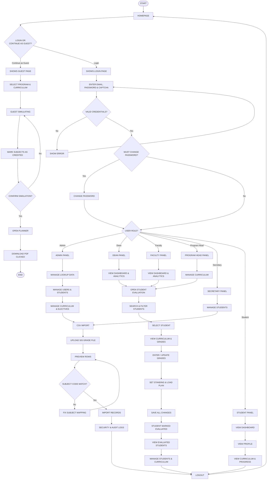

# Academic Evaluation Portal — Flowchart (Top → Bottom)

Layout: **START at top**, flow **downward** (⬇).  
Use in **Mermaid Chart**, **draw.io**, or Cursor preview.

**Requirements (FR-01–FR-10, NFR-01–NFR-13):** see [`Functional_and_Non-functional_Requirements.md`](Functional_and_Non-functional_Requirements.md)

---

## Copy this into Mermaid Chart

---

## draw.io — box order (top to bottom)

### Main entry
1. **START** (oval)  
2. **HOMEPAGE** (rectangle)  
3. **LOGIN OR CONTINUE AS GUEST?** (diamond)  

### If Guest (branch down)
4. SHOWS GUEST PAGE  
5. SELECT PROGRAM & CURRICULUM  
6. GUEST SIMULATING  
7. MARK SUBJECTS AS CREDITED  
8. CONFIRM SIMULATION? (diamond)  
9. OPEN PLANNER  
10. DOWNLOAD PDF CLICKED  
11. **END** (oval)  

### If Login (branch down)
4. SHOWS LOGIN PAGE  
5. ENTER EMAIL, PASSWORD & CAPTCHA  
6. VALID CREDENTIALS? (diamond)  
7. MUST CHANGE PASSWORD? (diamond)  
8. USER ROLE? (diamond)  

### Dean / Faculty — Student evaluation (vertical)
9. OPEN STUDENT EVALUATION  
10. SEARCH & FILTER STUDENTS  
11. SELECT STUDENT  
12. VIEW CURRICULUM & GRADES  
13. ENTER / UPDATE GRADES  
14. SET STANDING & LOAD PLAN  
15. SAVE ALL CHANGES  
16. STUDENT MARKED EVALUATED  
17. VIEW EVALUATED STUDENTS  

### Student portal (vertical)
9. STUDENT PANEL  
10. VIEW DASHBOARD  
11. VIEW PROFILE  
12. VIEW CURRICULUM & PROGRESS  
13. LOGOUT → back to HOMEPAGE  

---

## Tip for draw.io
- Drag shapes in a **single column** under each branch.  
- Use **↓ arrows only** between steps.  
- Put **decisions** as diamonds; **Yes/No** labels on the arrows going down.
